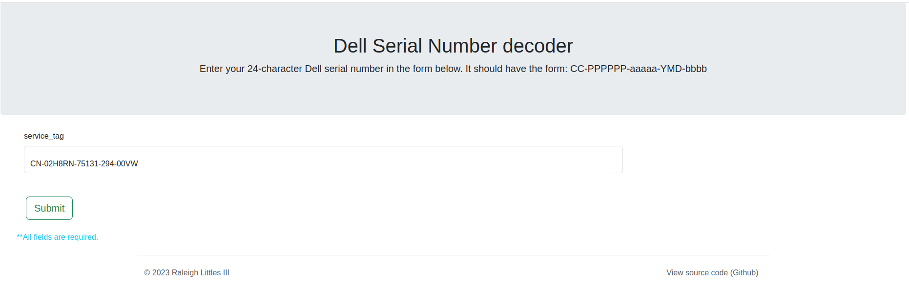
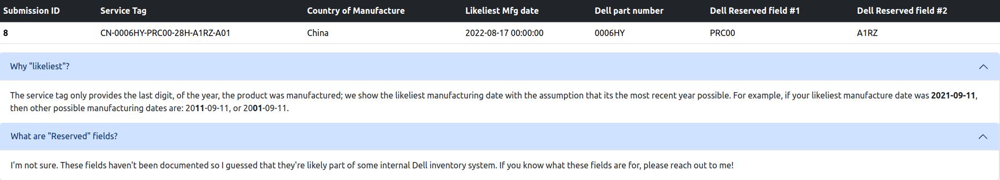

# About

This is a simple project for storing and tracking Dell serial numbers. It's a very bare web application that uses [Flask](https://flask.palletsprojects.com/) with an SQLite database underneath.

# Context

While not officially documented, people have discovered the format behind the serial numbers on (most?) Dell products:

* https://telcontar.net/KBK/Dell/date_codes
* https://www.partschase.com/index.php?route=forum/read&forum_path=9&forum_post_id=45

This project is just a simple web app that lets you decode the serial number. (Eventually I'd like to add support for other serial numbers).

# Setup

Clone the directory, install the `requirements.txt`, and then run flask:

```bash
$ flask --app main run --debug
```
After loading the page, you should see something that looks like this:



I have a CSV file with some serial numbers from the products I own, or ones that I found online: `serial_numbers.csv`.

These get loaded into the database during startup.

After you submit your own tag, you'll see:



Because serial numbers are supposed to be unique, you'll get an error if you try to submit a serial number that has been seen before.

The error message will tell you when it was originally seen:


(Yes I know the time is missing...)

# Lastly

## Tests

To run tests, do:

```bash
$ python -m pytest tests/
```

## Coming soon

- [ ] Deployment
- [ ] Cleanup